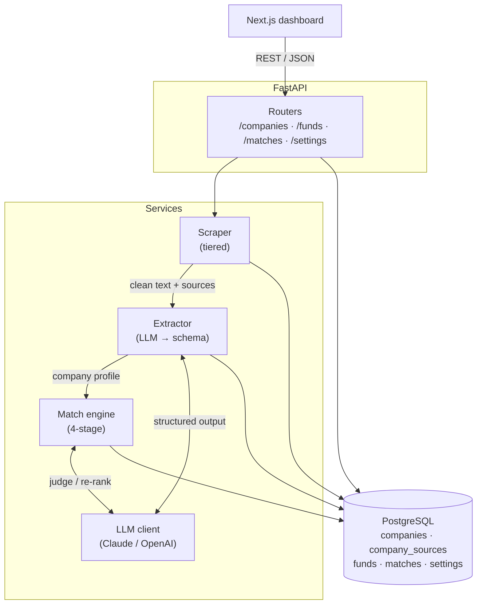
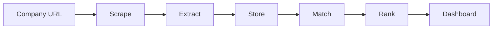

# DESCOvery_point — Build Plan

_SME analytics → matching with the most suitable PE funds._

This is the working blueprint for building a clean, demoable v1 and layering complexity later. Keep the initial build lean; every "Later" item is explicitly deferred so v1 stays shippable.

---

## 1. Goal & scope

**Input:** a company's website URL (target: SMB/SME).
**Output:** a dashboard showing (a) an extracted company summary with cited sources, and (b) a ranked shortlist of PE funds scored against their investment mandate, each linking to the fund's source for further reading.

**v1 must support (minimum):**
- Enter any company URL.
- Extract and **store** structured company details.
- Dashboard: company summary (with sources) + PE-fund matches ranked by mandate suitability, each linking to the fund source.
- Add a fund the user spots that isn't in the seed dataset.
- Choose Anthropic (default) or OpenAI as the LLM provider.

**Explicitly out of scope for v1** (revisit later): auth/multi-tenant, background job queue, full SEC EDGAR ingestion pipeline, embeddings/pgvector, CRM export, portfolio-level analytics.

---

## 2. Tech stack

| Concern | Choice | Notes |
|---|---|---|
| Language / env | Python ≥3.11, **uv** | All deps via `uv add`; never `pip install` ad hoc. |
| API | **FastAPI** + Uvicorn | Async, Pydantic v2 models, auto OpenAPI docs at `/docs`. |
| DB | **PostgreSQL** | SQLAlchemy 2.0 (async) + Alembic migrations. Start with plain columns + JSONB for flexible fields. |
| Validation | Pydantic v2 | Shared schemas for API + LLM structured output. |
| Scraping | `httpx` + `BeautifulSoup` Tier-1; **Claude `web_fetch`** Tier-2 fallback | Tiered — see §5. |
| LLM | Anthropic SDK (`anthropic`) default; OpenAI SDK (`openai`) alt | Provider abstraction — see §9. Default model `claude-sonnet-5`. |
| Frontend | **Next.js** (App Router, TypeScript) + Tailwind | Talks to FastAPI over REST. Simple dashboard; no SSR auth needed in v1. |
| Container | **Docker** + docker-compose | Deferred to a later milestone (§12). App + Postgres + (optional) frontend. |
| Tests | `pytest` + `pytest-asyncio`, `respx` for HTTP mocking | Mock the LLM and network in unit tests. |

Model-note: default is **`claude-sonnet-5`** (project decision). For extraction/matching use adaptive thinking + structured outputs (`messages.parse` / `output_config.format`). Verify the exact model-ID string against the Models API (`GET /v1/models`) on first run; bump to `claude-opus-4-8` / `claude-fable-5` for maximum reasoning quality at higher cost.

---

## 3. Architecture

**System (HLD):**



**Core pipeline** — keep each stage a separable, individually testable unit:



---

## 4. Data model (Postgres)

Initial tables (Alembic-managed). Use JSONB where the shape is fluid; promote to columns as it stabilises.

**`companies`**
- `id` (uuid, pk), `url`, `name`, `industry`, `sub_industry`, `location_country`, `location_region`
- `size_employees` (int, nullable), `revenue_estimate` (numeric, nullable), `ebitda_estimate` (numeric, nullable)
- `products` (jsonb: list), `summary` (text), `business_model` (text)
- `raw_extracted` (jsonb — full LLM output), `extraction_confidence` (jsonb — per-field), `status` (enum: pending/scraped/extracted/failed)
- `created_at`, `updated_at`

**`company_sources`** — provenance for the summary
- `id`, `company_id` (fk), `source_url`, `page_title`, `fetched_at`, `fetch_method` (enum: http/claude), `snippet` (text used as evidence)

**`funds`**
- `id` (uuid, pk), `name`, `firm`, `website_url`, `source_url` (authoritative link shown on dashboard)
- **Mandate** (the match target): `sectors` (jsonb list), `geographies` (jsonb list), `check_size_min_usd_m`, `check_size_max_usd_m`, `ebitda_min_usd_m`, `ebitda_max_usd_m`, `revenue_min_usd_m`, `revenue_max_usd_m`, `stage` (enum-ish), `thesis` (text)
- `provenance` (enum: seed/edgar/manual/url_extracted), `mandate_source` (enum: authoritative/ai_inferred), `mandate_confidence` (numeric)
- `created_at`, `updated_at`

**`matches`** — persisted results of a matching run
- `id`, `company_id` (fk), `fund_id` (fk), `run_id`
- `passed_hard_filters` (bool), `numeric_score`, `thesis_score`, `strategy_score`, `composite_score`
- `matched_on` (jsonb: {sector, geo, size}), `rationale` (text — the "why this fits"), `rank` (int)
- `weights_used` (jsonb snapshot), `created_at`

**`settings`** — single-row (or per-user later) app config
- `id`, `weight_thesis`, `weight_numeric`, `weight_strategy` (default 0.40 / 0.35 / 0.25)
- `llm_provider`, `llm_model`, `scrape_max_pages`, `updated_at`

---

## 5. Scraping (tiered, detector-driven)

Default cheap, escalate only when needed:

1. **Tier 1 — HTTP fetch + parse (default).** `httpx.get` a small page set (`/`, `/about`, `/products`, `/services`, `/contact`), extract clean text + capture each `source_url` into `company_sources`.
2. **Detector.** After Tier 1, decide if the content is insufficient — e.g. total visible text below a token/char threshold, near-empty `<body>`, obvious JS-app shell (`__NEXT_DATA__`/`ng-app`/root-div-only), or an anti-bot/consent wall. Only if the detector trips do we escalate.
3. **Tier 2 — fallback.** **Claude `web_fetch`** (`tier2_claude.py`) — the company URL is handed to Claude's server-side `web_fetch` tool; Anthropic's infrastructure fetches the page (bypassing bot protection / JS shells that defeat Tier-1) and the fetched text is returned as `ScrapedPage`s for the extractor. Uses the existing `ANTHROPIC_API_KEY`; no extra service key or headless browser.

Config: `SCRAPE_TIER2=claude|off`, `SCRAPE_MAX_PAGES`. Always record `fetch_method` per source so the dashboard can show how each fact was obtained. Respect `robots.txt` and set a descriptive User-Agent.

---

## 6. Extraction (URL → structured company profile)

- Feed cleaned page text (with source URLs) to the LLM and force a **structured output** matching the `CompanyProfile` Pydantic schema (industry, location, size, revenue/EBITDA estimates, products, business model, summary).
- Ask the model to attach, per field, a **confidence** and the **source URL(s)** it relied on → stored in `extraction_confidence` + `company_sources`. This is what powers "summary with sources" on the dashboard.
- Numeric fields (revenue, EBITDA, employees) are frequently **absent for SMEs** — the schema allows null and we never fabricate. Missing ≠ zero (this matters for scoring, §8).
- Persist everything; set `status = extracted`.

---

## 7. Fund data & the "Add fund" flow

**v1 (recommended):** ship a small, **mandate-complete seed** of ~15–25 real funds (`funds_seed.json` → loaded on startup / via `uv run seed`), each with sectors, geographies, check size, EBITDA/revenue range, thesis, and an authoritative `source_url`. Deterministic and reliable for the demo. `provenance = seed`, `mandate_source = authoritative`.

**Add-fund flow (dashboard):** accept a **fund URL** → run the same scrape+extract pipeline against a `FundMandate` schema → pre-fill an editable form the user confirms/corrects → save with `provenance = url_extracted`. A pure manual form is the fallback. This reuses the extraction machinery and matches the app's theme.

**Later — SEC EDGAR ingestion (own milestone).** Bulk **Form ADV** (adviser identity, AUM) + **Form D** (exempt private-fund offerings, issuer industry) give breadth but *not* a match-ready mandate. Pipeline: pull filings → dedupe advisers/funds → **LLM-infer** the mandate (sectors/geo/check size) from filing text + fund website → store with `mandate_source = ai_inferred` and a `mandate_confidence`. The dashboard must visibly flag AI-inferred mandates so the user weighs them accordingly.

---

## 8. Matching engine (4-stage)

Run per company against the fund universe; persist to `matches`.

- **Stage 1 — Hard filters.** Eliminate on non-overlap of **geography** and **sector**. (Keep filters forgiving: unknown/empty company sector should not hard-drop everything — treat missing as "no constraint," not "fail.")
- **Stage 2 — Soft numeric scoring.** Score fit on **range criteria** (check size, EBITDA, revenue) → `numeric_score` (0–100). **Missingness rule:** when a company numeric is unknown, do **not** downscore for it — redistribute that sub-weight across the available numeric signals (or mark "insufficient data") rather than penalising. Always surface the numeric facts we *do* have so the user can judge.
- **Stage 3 — Thesis fit (semantic / LLM judge).** "Does this business match what the fund is trying to build?" → `thesis_score` (0–100) with a short justification. (v1: LLM judge over company summary + fund thesis. Embeddings/pgvector prefilter is a Later optimisation for large fund sets.)
- **Stage 4 — LLM re-rank + rationale, top 10 only.** Take the top candidates by composite score, hand the LLM the company profile + each candidate; ask it to (a) **adjust ordering** and (b) write a **"Why this fits"** justification per fund → `rationale`, final `rank`.

`strategy_score` (the third weighted dimension) captures qualitative strategic fit (e.g. buy-and-build angle, add-on potential, operational thesis) assessed alongside the thesis judge.

---

## 9. Scoring & weights

**Composite** = `weight_thesis·thesis + weight_numeric·numeric + weight_strategy·strategy`, defaults **0.40 / 0.35 / 0.25**, editable in **Settings** and applied live on the dashboard (recompute composite + re-sort without re-running the LLM).

- Weights are stored per run (`matches.weights_used`) so results are reproducible.
- **Do not downscore for missing numerics** (SMEs often lack public financials). When a dimension lacks data, renormalise the remaining weights and label the card "financials not disclosed" rather than showing an artificially low score.
- Present every available numeric fact (with its source) so the user makes an informed decision — the score guides, it doesn't gatekeep.

---

## 10. LLM provider abstraction

- Single `LLMClient` interface: `extract(schema, text) -> obj`, `judge(prompt, schema) -> obj`, `rerank(...)`.
- Two implementations: `AnthropicClient` (default, `claude-sonnet-5`, adaptive thinking, `messages.parse`/`output_config.format` for structured output) and `OpenAIClient`.
- Selected by `LLM_PROVIDER` in `.env`; per-call model overridable. Keys never logged; both live in `.env` (gitignored) / `.env.example`.

---

## 11. API surface (FastAPI)

- `POST /companies` `{url}` → kicks scrape+extract, returns company id/status.
- `GET /companies/{id}` → profile + sources + status.
- `POST /companies/{id}/match` → run 4-stage engine, return ranked matches.
- `GET /companies/{id}/matches` → persisted matches (re-weightable client-side).
- `GET /funds` / `POST /funds` (manual) / `POST /funds/from-url` `{url}` (extract+confirm).
- `GET /settings` / `PUT /settings` (weights, provider, model, scrape config).

v1 runs scrape/extract/match **synchronously** (with sensible timeouts). If latency hurts the demo, add a lightweight background task / job status next — not a full queue.

---

## 12. Milestones (phased)

1. **M0 — Skeleton.** ✅ uv deps, FastAPI app, Postgres + Alembic, health check, settings row, `.env` wired.
2. **M1 — Ingest + extract.** ✅ Tier-1 scraper, extractor → `CompanyProfile`, persist company + sources.
3. **M2 — Funds + matching.** ✅ Seed dataset loader, 4-stage engine, persist matches, composite scoring with weights + missingness rule.
4. **M3 — Frontend.** ✅ Next.js dashboard: URL input, company summary w/ sources, ranked fund cards (score breakdown, matched-on, "why this fits", source link), live re-weighting, settings.
5. **M4 — Add-fund + tiered scrape.** ✅ `from-url` fund flow, detector + Tier-2 fallback (Claude `web_fetch`).
6. **M5 — Docker.** ✅ Backend + frontend Dockerfiles + docker-compose (db + api + web); entrypoint migrates + seeds. Verified end-to-end.
7. **Later.** SEC EDGAR ingestion; embeddings/pgvector prefilter; background jobs; auth/multi-user; export.

---

## 13. Suggested repo structure

```
DESCOvery_point/
├─ pyproject.toml            # uv-managed
├─ .env / .env.example       # secrets (.env gitignored)
├─ app/
│  ├─ main.py                # FastAPI app + routers
│  ├─ config.py              # pydantic-settings (reads .env)
│  ├─ db.py                  # async engine/session
│  ├─ models/                # SQLAlchemy models
│  ├─ schemas/               # Pydantic (CompanyProfile, FundMandate, Match, ...)
│  ├─ routers/               # companies, funds, matches, settings
│  ├─ services/
│  │  ├─ scraper/            # tier1_http, detector, tier2_claude
│  │  ├─ extractor.py
│  │  ├─ matching/           # filters, numeric, thesis_judge, rerank, score
│  │  └─ llm/                # base, anthropic_client, openai_client
│  └─ seed/funds_seed.json
├─ alembic/                  # migrations
├─ tests/
└─ web/                      # Next.js app (later milestone)
```

---

## 14. Environment & config

`.env` / `.env.example` already created and hold: `LLM_PROVIDER`, `ANTHROPIC_API_KEY`, `ANTHROPIC_MODEL`, `OPENAI_API_KEY`, `OPENAI_MODEL`, Postgres vars + `DATABASE_URL`, app host/port. Add as needed: `SCRAPE_TIER2`, `SCRAPE_MAX_PAGES`. `.env` is gitignored.

Common commands:
```
uv add fastapi "uvicorn[standard]" sqlalchemy alembic psycopg[binary] pydantic-settings httpx anthropic openai
uv run uvicorn app.main:app --reload
uv run alembic upgrade head
uv run pytest
```

---

## 15. Testing strategy

- Unit-test each pipeline stage in isolation: scraper (mock HTTP with `respx`), extractor (mock LLM → fixed schema), each matching stage (deterministic inputs), scoring math incl. the **missing-numeric renormalisation**.
- One integration test that runs URL → extract → match against a fixture site + seed funds with the LLM client mocked.
- Delete throwaway fixtures/scripts once they've served their purpose.

---

## 16. Open decisions (defaults chosen — flip anytime)

| Decision | v1 default | Alt |
|---|---|---|
| Default LLM | Anthropic `claude-sonnet-5` | `claude-opus-4-8` / `claude-fable-5` / OpenAI |
| Fund universe (v1) | ~15–25 curated mandate-complete seed | Full EDGAR ingestion now |
| EDGAR mandates | LLM-inferred, flagged `ai_inferred` + confidence | Authoritative-only |
| Add-fund input | Fund **URL** → extract → confirm (manual fallback) | Manual form only |
| Tier-2 scrape | Claude `web_fetch` | Headless-browser render |
| Execution | Synchronous per request | Background jobs |
