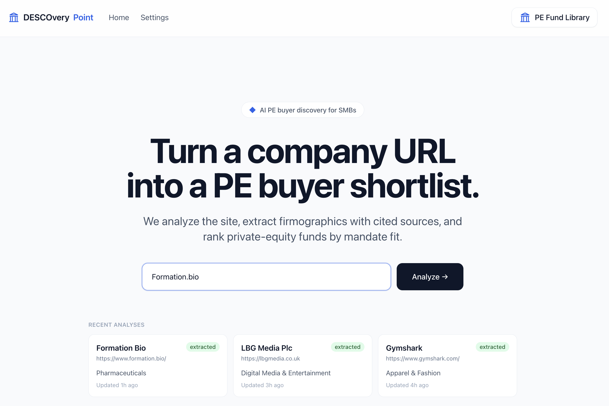

# DESCOvery_point

_An AI tool that takes a company's **website URL** and returns a ranked
shortlist of private-equity funds that would be good potential buyers._

The pipeline runs in three separable, individually testable stages —
**Company** (what are we selling?) → **Fund** (who could buy it?) →
**Matching** (which buyers fit, and why?). For the full walkthrough with a
worked example, see **[about.md](about.md)** (or the one-paragraph
**[tldr_about.md](tldr_about.md)**).



## Quickstart (Docker)

Full stack — dashboard, API, and Postgres — in a few commands. All you need is
[Docker](https://docs.docker.com/get-docker/) and an LLM API key.

```bash
cp .env.example .env         # then paste your ANTHROPIC_API_KEY into .env
docker compose up --build    # first run auto-migrates the DB and seeds the funds

# Optional but recommended — load the bundled full dataset (55k+ funds + demo
# analyses) once the API is serving on :8000, in a second terminal:
gunzip -c db/descovery_seed.sql.gz | docker compose exec -T db psql -U descovery -d descovery_point
```

Then open:

- **http://localhost:3000** — Next.js dashboard (paste a company URL, run a match)
- **http://localhost:8000/docs** — FastAPI interactive docs (drive the pipeline directly)

Stop with `Ctrl-C`. `docker compose down` tears it down; add `-v` to also wipe the
database volume.

> New to the project? The [detailed walkthrough](#quick-start-with-docker-recommended)
> and [full configuration reference](#api-keys--configuration) are below.

## Brief

Design a simple AI-powered tool that takes a company's website URL as input,
focusing primarily on small and medium-sized businesses (SMBs). The tool should
analyze the website's content to extract key information about the company, such
as industry, location, size, and product offerings. Based on this analysis, it
should generate a shortlist of private equity funds that would be potential good
buyers for the business.

Your task is to create a basic prototype of this tool, which you will demo
virtually in your discussion with an interviewer, using an API of any LLM-based
resource at your disposal (e.g., OpenAI's GPT API) rather than a chat interface.
We're not concerned about the user interface—you can use low-code platforms,
command-line interfaces, or any other method you prefer. The focus should be on
functionality and effective use of the LLM API.


## How it works

The pipeline is **scrape → extract → store → match → rank**, in three stages:

1. **Company** — scrape the site (escalating to Claude's `web_fetch` only when a
   page is thin or bot-walled), LLM-extract a structured profile (industry,
   location, size, financials, ownership), then optionally enrich the gaps from
   the web (LinkedIn, PitchBook, news). Enrichment runs as a background job, so
   `POST /companies` returns immediately and the dashboard polls for progress.
2. **Fund** — assemble the buyer universe from three provenances, each flagged
   with its trust level: a curated seed, funds you add by URL, and real SEC
   EDGAR filings.
3. **Matching** — a 4-stage engine (deterministic geo/size gates → a free
   size-fit score → an LLM mandate / strategy / value-creation judge → an LLM
   re-rank + rationale) returns a ranked shortlist, each fund carrying a
   cited source and a plain-language "why this fits."

It's a FastAPI + async SQLAlchemy/Postgres (pgvector) backend, a Next.js
dashboard (`web/`), and a Docker Compose stack that wires them together. Missing
data is modelled as null — **never zero or a guess** — and scores guide rather
than gatekeep, so the user always makes the final call. See
**[about.md](about.md)** for the full design rationale.

## Prerequisites

To run the full app the quick way, all you need is:

- **Docker** and **Docker Compose** (Docker Desktop on macOS/Windows includes both) — [install](https://docs.docker.com/get-docker/)
- An **LLM API key** — Anthropic (default) or OpenAI. The matching/extraction steps call an LLM, so a key is required for real results.

For local (non-Docker) development you also need:

- **[uv](https://docs.astral.sh/uv/)** for the Python backend
- **Node.js 18+** and **npm** for the `web/` frontend
- A running **Postgres 16** instance

---

## Quick start with Docker (recommended)

This is the easiest way to try the app end to end.

**1. Unzip and enter the project**

```bash
unzip DESCOvery_point.zip
cd DESCOvery_point
```

**2. Create your `.env` from the template**

```bash
cp .env.example .env
```

**3. Add your LLM API key**

Open `.env` and fill in a key for your chosen provider. The default provider is
Anthropic:

```env
LLM_PROVIDER=anthropic
ANTHROPIC_API_KEY=sk-ant-...        # paste your key here
ANTHROPIC_MODEL=claude-sonnet-5
```

To use OpenAI instead, set `LLM_PROVIDER=openai` and fill in `OPENAI_API_KEY`.

> `.env` is gitignored — never commit it. The Postgres defaults in the template
> work as-is for local use; you don't need to change them for Docker.

**4. Start the stack**

```bash
docker compose up --build
```

This launches three services and, on first run, automatically applies database
migrations and seeds the curated fund list:

| Service | URL | Description |
| --- | --- | --- |
| `web` | http://localhost:3000 | Next.js dashboard |
| `api` | http://localhost:8000 | FastAPI backend (interactive docs at http://localhost:8000/docs) |
| `db`  | localhost:5432 | Postgres 16 + pgvector (data persisted in the `pgdata` volume) |

The seed loads 16 curated funds — enough to demo immediately.

**5. Load the full dataset (recommended)**

This zip bundles a full database snapshot at `db/descovery_seed.sql.gz` — **55k+
real funds** (2,220 with semantic embeddings) plus a few pre-analyzed demo
companies and their match results. Once the API is serving on :8000, load it in a
second terminal:

```bash
gunzip -c db/descovery_seed.sql.gz | docker compose exec -T db psql -U descovery -d descovery_point
```

It replaces the 16-fund starter seed with the complete set in one transaction, so
you get the full fund universe without running EDGAR ingestion or paying for
embeddings. (To rebuild the data yourself instead, see
[Loading fund data](#loading-fund-data).)

**6. Use it**

Open **http://localhost:3000**, paste a company website URL, and run a match.
The API docs at **http://localhost:8000/docs** let you drive the same pipeline
directly.

To stop: `Ctrl-C`, then `docker compose down` (add `-v` to also wipe the database volume).

---

## API keys & configuration

All configuration lives in `.env` (copied from `.env.example`). Key settings:

| Variable | Required | Default | Notes |
| --- | --- | --- | --- |
| `LLM_PROVIDER` | yes | `anthropic` | `anthropic` or `openai` |
| `ANTHROPIC_API_KEY` | if provider = anthropic | — | from https://console.anthropic.com |
| `ANTHROPIC_MODEL` | no | `claude-sonnet-5` | |
| `OPENAI_API_KEY` | for OpenAI provider **or embeddings** | — | Also required for the pgvector semantic pre-filter — embeddings always use OpenAI, even under `LLM_PROVIDER=anthropic`. From https://platform.openai.com |
| `OPENAI_MODEL` | no | `gpt-4o` | |
| `OPENAI_EMBEDDING_MODEL` | no | `text-embedding-3-small` | Model for the semantic pre-filter |
| `EDGAR_USER_AGENT` | no | includes a contact | SEC requires a contact string in the request header; override with your own |
| `EDGAR_INGEST_LIMIT` | no | `100` | Default cap on funds added per `ingest-edgar` run |
| `SCRAPE_TIER2` | no | `claude` | `claude` or `off` — JS-heavy / bot-protected-site fallback |
| `ENRICH_SOURCE` | no | `claude` | `claude` or `off` — web-search enrichment (headcount, revenue, ownership, investors) |
| `POSTGRES_USER` / `POSTGRES_PASSWORD` / `POSTGRES_DB` | no | `descovery` / `descovery` / `descovery_point` | |
| `DATABASE_URL` | no | see `.env.example` | used for local (non-Docker) runs |
| `CORS_ORIGINS` | no | `http://localhost:3000` | |

**Tier-2 scraping.** By default the scraper uses a plain HTTP fetch (Tier-1),
which is enough for most sites. When a page comes back thin or blocked
(JavaScript-heavy or bot-protected sites), it escalates to `SCRAPE_TIER2=claude`,
which fetches the page via Claude's server-side `web_fetch` tool using the
`ANTHROPIC_API_KEY` you already set — no extra key or browser to install. Set
`SCRAPE_TIER2=off` to disable the fallback.

---

## Loading fund data

The matcher ranks whatever funds are in the database. The quickest path is to
load the **bundled database snapshot** (option 0); otherwise there are three ways
to populate it from scratch, from quickest to most complete. (In Docker, run
these with `docker compose exec api <command>`; locally, with `uv run <command>`.)

**0. Bundled snapshot — the whole universe, instantly.** This zip ships a full
database dump at `db/descovery_seed.sql.gz` — **55k+ real funds** (2,220 with
semantic embeddings) plus a few pre-analyzed demo companies and their match
results, so you get the complete dataset without running EDGAR ingestion or
paying for embeddings. Load it **after** the stack is up (the schema must exist
first):

```bash
docker compose up --build            # wait until the API is serving on :8000
gunzip -c db/descovery_seed.sql.gz | docker compose exec -T db psql -U descovery -d descovery_point
```

The dump wipes the 16-fund auto-seed and replaces it with the full set (it runs
in a single transaction, so a failure rolls back cleanly). That's all you need —
the options below are only for rebuilding the data yourself.

**1. Curated seed — automatic.** `docker compose up` seeds 16 hand-picked PE
funds from `app/seed/funds_seed.json` on first run — enough to demo the pipeline
immediately. It's idempotent (funds already present by name are skipped), so
it's safe to re-run:

```bash
docker compose exec api seed      # Docker
uv run seed                       # local
```

**2. SEC EDGAR ingestion — the real universe.** Pull real funds from SEC bulk
data (Form ADV / Form D): it downloads the filings, discovers Private-Equity-Fund
candidates, infers an investment mandate for each, and inserts them as funds.

```bash
uv run ingest-edgar                                    # both sources, capped at EDGAR_INGEST_LIMIT (100)
uv run ingest-edgar --source form_d --quarter 2026q2 --limit 20
uv run ingest-edgar --bulk-register                    # register the whole candidate pool with regulatory data but no mandate (fast)
uv run ingest-edgar --backfill-metadata                # fill regulatory fields on funds already loaded
```

SEC requires a contact string in the request User-Agent — a default is provided;
override it with `EDGAR_USER_AGENT`. Downloaded bulk data is cached under
`data/edgar`; add `--skip-download` to reuse it.

**3. Semantic embeddings — optional, improves ranking.** The matcher includes a
pgvector semantic pre-filter. After loading funds (seed or EDGAR), compute and
store each fund's mandate embedding:

```bash
docker compose exec api backfill-embeddings   # Docker
uv run backfill-embeddings                    # local
```

It only fills funds that don't have an embedding yet, so it's cheap and safe to
re-run. **It requires `OPENAI_API_KEY`** — embeddings always use OpenAI because
Anthropic has no embeddings API, even when `LLM_PROVIDER=anthropic` for
everything else. Without embeddings the matcher still works; it just skips the
semantic dimension (which is never scored as zero).

### The vector database

The `db` service is **pgvector** (`pgvector/pgvector:pg16`), not plain Postgres.
The `vector` extension and the `funds.thesis_embedding` column are created
automatically by the Alembic migrations that run on startup (migration `0011`) —
there's nothing to install or enable by hand. The column stays empty until you
run `backfill-embeddings` (step 3 above).

---

## Local development (without Docker)

Run the backend and frontend directly for faster iteration. You'll need a Postgres
instance running (the `db` service from `docker compose up db` works, or your own).

**Backend (Python / uv):**

```bash
uv sync                                # install dependencies from the lockfile
uv run alembic upgrade head            # apply migrations (needs Postgres up)
uv run seed                            # load the curated fund seed
uv run uvicorn app.main:app --reload   # serve the API on :8000 (docs at /docs)
```

**Frontend (`web/`, Next.js):**

```bash
cd web
npm install
npm run dev                            # dev server on :3000 (needs the API on :8000)
```

---

## Running the tests

The test suite is intentionally **DB- and network-free** (the LLM is faked, HTTP
is mocked with `respx`), so it runs without Postgres or any API keys:

```bash
uv run pytest
```

---

## Project layout

- `app/` — FastAPI backend: `services/` (scrape/extract/match pipeline), `models/`, `schemas/`, `routers/`, `seed/`
  - `app/services/edgar/` — SEC EDGAR fund ingestion (`ingest-edgar`)
  - `app/services/matching/embeddings.py` — pgvector semantic pre-filter (`backfill-embeddings`)
- `web/` — Next.js dashboard
- `alembic/` — database migrations (`0011` provisions the pgvector extension + column)
- `db/descovery_seed.sql.gz` — bundled full database snapshot (see [Loading fund data](#loading-fund-data), option 0)
- `docker/entrypoint.sh` — waits for Postgres, migrates, seeds, then serves the API
- `about.md` — full design walkthrough (Company → Fund → Matching) with a worked example; `tldr_about.md` is the one-paragraph version
- `BUILD_PLAN.md` — milestone plan and status; read before feature work
- `CLAUDE.md` — guidance for working in this repo


