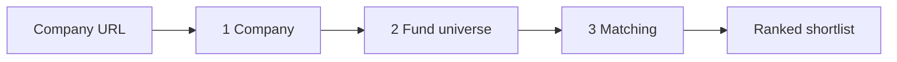

# DESCOvery_point — About

_An AI tool that takes a company's **website URL** and returns a ranked shortlist
of private-equity funds that would be good potential buyers._

The system is built around three concerns, in pipeline order: **Company** (what
are we selling?), **Fund** (who could buy it?), and **Matching** (which buyers
fit, and why?). Each is a separable, individually testable stage.

The whole thing degrades gracefully: missing data is never treated as zero,
numbers are never fabricated, and every fact carries a cited source.

> **Worked example — Formation Bio.** Throughout this doc we use
> [formation.bio](https://formation.bio) as the target company: an AI-native
> pharmaceutical business (formerly TrialSpark), headquartered in New York and
> privately held with venture backing. It's a deliberately instructive case — a
> high-growth, VC-backed company rather than a classic mature-buyout target — so
> it exercises exactly the judgement the matching engine exists to get right
> (growth-equity fit, *not* a control buyout). The screenshots below come from an
> actual run already stored in the app.

<!-- Replace with a screenshot saved at docs/screenshots/formation-bio-dashboard.png -->

*The dashboard for formation.bio — company summary on the left, ranked fund shortlist on the right.*

---

## 1. Company — extracting the target's profile

**Outputs collected** — a structured `CompanyProfile`: name, industry /
sub-industry, country / region, employee headcount, revenue and EBITDA estimates
(USD millions), products, business model, a summary, plus the PE-relevant signals
`ownership_status`, `investors`, `competitors`, `growth_trajectory`, and
`deal_stage`. Every populated field carries a **0–1 confidence** and the **source
URL(s)** it rests on.

**How it's retrieved** — three steps, in order:

1. **Scrape (tiered).** *Tier 1* is a plain `httpx` fetch + BeautifulSoup parse of
   a handful of pages (home, about, products, …). A **detector** inspects the
   result and, only when the content is thin or bot/JS-walled, escalates to
   *Tier 2* — Claude's server-side `web_fetch` tool (`SCRAPE_TIER2=claude`), which
   fetches through Anthropic's infrastructure. Every page records its
   `fetch_method` (`http` / `claude`).
2. **Extract.** The cleaned text is handed to a provider-agnostic `LLMClient`
   (Anthropic `claude-sonnet-5` by default, OpenAI selectable) which coerces it
   into the `CompanyProfile` schema, attaching per-field confidence and citations.
3. **Enrich (optional, `ENRICH_SOURCE=claude`).** SMEs rarely publish headcount,
   revenue, or ownership on their own site, so a second pass uses Claude's
   server-side `web_search` tool to gather firmographics from LinkedIn, PitchBook,
   Crunchbase, and news — filling **only fields the website left empty** (the
   website stays authoritative), each cited with `fetch_method=search`.

Runs as a **background job**: `POST /companies` returns immediately with
`enrichment_status=pending` and a live `progress` log the UI polls; a previously
analysed URL is reused, and `POST /companies/{id}/refresh` re-runs it.

**Rationale** — cheap-by-default, escalate-only-when-needed keeps cost and
latency low. The financial signals (revenue/EBITDA/ownership/deal_stage) exist
specifically to feed the match pillars below; because SMEs disclose so little,
**missing is modelled explicitly as null, never zero or a guess.**

**Formation Bio, in practice.** Its website establishes what the company *does* —
AI-driven drug development — yielding the industry (pharmaceuticals / biotech),
the New York HQ, products, and business model. The enrichment pass then fills
what the site omits: that it is **VC-backed** (surfacing investors such as
Andreessen Horowitz, Sequoia, and Sanofi from PitchBook / news) and a
**growth-stage** `deal_stage`. Every fact is tagged with where it came from —
website `http` vs enrichment `search`.

<!-- Replace with a screenshot saved at docs/screenshots/formation-bio-company-profile.png -->

*Formation Bio's extracted profile: website facts plus search-enriched firmographics, each with its source.*

---

## 2. Fund — building the buyer universe

**Outputs collected** — each fund is stored as an investment **mandate** (the
thing the matcher scores against): target `sectors`, `geographies`, `check_size`
band, `ebitda` / `revenue` bands (USD m), `stage`, and a free-text `thesis`. EDGAR
funds additionally carry regulatory metadata straight from the filing — AUM
(`gross_asset_value_usd`), amount raised, investor count, filing date, auditor /
prime broker / custodian, and a stable regulatory id.

**How it's retrieved** — three provenances, each flagged so its trust level is
visible:

| Provenance | How | Mandate source |
|---|---|---|
| **`seed`** | ~16 curated, mandate-complete real funds (`funds_seed.json`) | `authoritative` |
| **`url_extracted`** | `POST /funds/from-url`: scrape + LLM-extract a fund site into a `FundMandate`, user confirms/edits (manual form is the fallback) | `authoritative` |
| **`edgar`** | Bulk **Form ADV** (adviser identity, AUM, service providers) + **Form D** (private offerings, amount raised, investor count) → dedupe/merge into fund candidates → resolve website (via `web_search` if the filing has none) → scrape + LLM-**infer** the mandate | `ai_inferred` (confidence 0.6), or `pending` if only registered |

EDGAR supplies the **candidate universe** — real, currently-active fund
identities from authoritative regulatory filings — not the mandate itself: the
mandate is always read from the fund's own site (or left null), **never
fabricated**. Bulk registration can load tens of thousands of funds with
regulatory data but no mandate (`pending`); a firm-level pass then scrapes each
GP's site once to fill mandates at scale.

**Rationale** — the seed guarantees a reliable demo; the URL flow lets a user add
a fund they spot; EDGAR gives real breadth. AI-inferred mandates are always
distinctly flagged (`mandate_source=ai_inferred`) so the user weighs them
accordingly.

The funds page shows the assembled universe — seed, URL-added, and EDGAR funds
side by side, each badged with its provenance and mandate source. For Formation
Bio, this is the pool the next step narrows down to the healthcare / biotech and
growth-oriented investors that could plausibly buy it.

<!-- Replace with a screenshot saved at docs/screenshots/funds-universe.png -->

*The fund universe: curated seed, user-added, and EDGAR-sourced funds, with provenance and mandate-source flags.*

---

## 3. Matching — scoring fit and ranking

### The ideal dimensions (what actually determines a good buyer)

Four pillars, each a matter of degree, some carrying gate-eligible sub-signals:

| Pillar | What it asks | Gate or graded |
|---|---|---|
| **Mandate fit** | Is the target inside the fund's investable box? (sector, business model, size vs band, geography) | gross size / geo miss **gates**; centrality **graded** |
| **Strategy & deal fit** | Is this the fund's kind of deal? (buyout / growth / roll-up / turnaround / carve-out, lifecycle stage, transactability from ownership) | transactability conflict **gates**; rest **graded** |
| **Value-creation fit** | Is this fund especially good *for this* company? (buy-and-build, internationalisation, professionalising a founder business, sector operating expertise) | **graded** |
| **Executability & timing** | Can they transact now? (dry powder, vintage, recent deal pace) | **graded (soft)** |

**What's built:** the first three pillars are scored and composed. The fourth
(executability/timing) is defined here but **not yet scored** — we don't hold
fund vintage / dry-powder data — so it's cleanly omitted rather than faked.

### The 4-stage engine

- **Stage 1 — Hard filters (deterministic).** Exclude only on a clear
  **geography** mismatch or a **gross size** mismatch (a disclosed metric >10×
  outside the fund's band on *every* assessable axis). Deliberately forgiving:
  an unknown attribute is treated as "no constraint," never a failure. Sector is
  *not* gated here — taxonomies rarely align on a substring — it's judged
  semantically in Stage 3.
- **Stage 2 — Size fit (deterministic, free).** The quantitative half of Mandate
  fit: score the company's scale against the fund's EBITDA / revenue / check-size
  bands (0–100), with coarse recoveries — enterprise value from EBITDA, revenue
  from headcount, an implied check band from a fund's AUM — so a size signal
  survives thin data. Inferred inputs are flagged.
- **Stage 3 — LLM fit judge (semantic).** To bound cost at scale, only the top
  **K=100** Stage-1 survivors (ranked by Stage-2 size fit + an optional
  **embedding** cosine similarity, pgvector) reach the judge, run concurrently.
  It scores three axes 0–100 — `mandate_fit` (sector/thesis centrality),
  `strategy_fit` (deal/playbook vs the company's ownership & stage),
  `value_creation_fit` — and sets `plausible_fit`, which drops clear mismatches
  from the shortlist entirely.
- **Stage 4 — LLM re-rank + rationale.** The top ~10 are re-ordered and given a
  concise **"why this fits"** justification grounded in the profile and mandate.

### Scoring & missingness

**Composite** = weighted mean of the three pillars, defaults **mandate 0.40 /
strategy 0.35 / value_creation 0.25**, editable in Settings and re-weightable
live on the dashboard. Weights are snapshotted per run for reproducibility.

The core rule: **absent dimensions are dropped and the remaining weights
renormalised** — a company with no financials is never penalised for the gap.
The LLM is optional; without it, Stages 3–4 are skipped and funds rank on the
deterministic size fit alone, so the engine always returns a usable shortlist.

**Rationale** — cheap deterministic gates and scores run over every fund; the
expensive LLM reasoning is reserved for the handful of candidates that survive,
where nuanced sector/strategy/value-creation judgement actually matters. Scores
**guide**, they don't gatekeep: every available fact is surfaced with its source
so the user makes the final call.

### Formation Bio's shortlist

Running the engine over the fund universe shows the pillars working together:

- **Stage 1** passes US and global funds on geography; because Formation Bio is a
  large, well-funded business, any sub-scale small-cap buyout funds fall away on
  the gross-size gate.
- **Strategy fit** is where the nuance shows: a VC-backed, fast-growing,
  founder-led company is a **growth-equity** target, so healthcare/tech growth
  investors score highly while control-buyout and turnaround funds are correctly
  deprioritised — *even when their sector overlaps*.
- **Value-creation fit** rewards funds that bring life-sciences operating
  expertise and scale-up capital to a company at this stage.

Each card carries a plain-language **"why this fits,"** and the weights can be
re-tuned live to see the ranking respond.

<!-- Replace with a screenshot saved at docs/screenshots/formation-bio-matches.png -->

*Formation Bio's ranked shortlist — each fund with its mandate / strategy / value_creation breakdown and rationale.*

<!-- Replace with a screenshot saved at docs/screenshots/formation-bio-scoring-weights.png -->

*Live weight controls — re-weighting the three pillars re-sorts the shortlist without re-running the LLM.*
